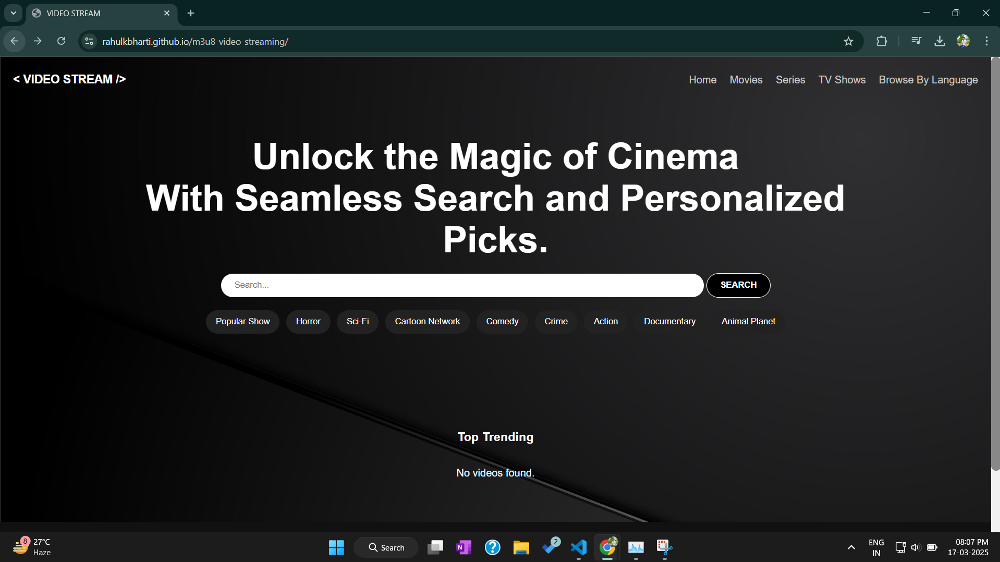
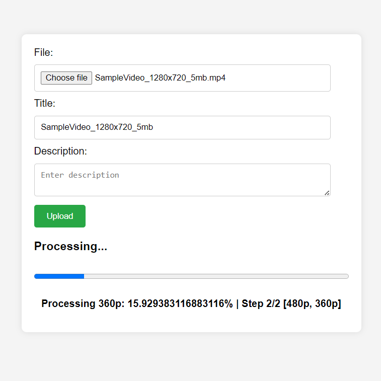

# m3u8-video-streaming

This project is a video streaming application that uses the M3U8 format for streaming video content. It includes both backend and frontend components to handle video uploads, processing, and streaming.

## Live Demo

Check out the live demo of the application [here](https://rahulkbharti.github.io/m3u8-video-streaming/).
### Output :


### Upload Video:


## Key Features

- **Video Uploads**: Users can upload video files through the frontend interface.
- **Video Processing**: The backend processes uploaded videos to generate multiple resolutions for adaptive streaming.
- **M3U8 Playlist Generation**: Automatically generates M3U8 playlists for streaming.
- **Video Streaming**: Streams video content using the M3U8 format.
- **Responsive Frontend**: User-friendly HTML pages for uploading and playing videos.
- **Docker Support**: Easily containerize the application using Docker.
- **CI/CD Integration**: Automated testing and deployment using GitHub Actions.
- **Database Integration**: Stores metadata about uploaded videos in a database.
- **Utility Functions**: Common utilities to support various backend operations.


## Backend

The backend is built with Node.js and Express. It handles video uploads, processing, and streaming.

### Key Files

- `index.js`: Main application file.
- `generate-res.mjs`: Script to generate video resolutions.
- `routes.js`: Defines the API routes.
- `common/utils.js`: Utility functions.
- `config/db.js`: Database configuration.
- `models/file_model.js`: Database model for files.


## Frontend

The frontend consists of HTML files that provide the user interface for uploading and playing videos.

### Key Files

- `index.html`: Main page.
- `player.html`: Video player page.
- `upload.html`: Video upload page.

## Docker & CI/CD

The project includes a Dockerfile for containerization and The project uses GitHub Actions for continuous integration and deployment.

### Workflows

- `.github/workflows/main.yml`: Main CI workflow for backend deployment on on render - Build ,test and Deploy.
- `.github/workflows/static.yml`: Static Site Deployment using github pages workflow.

### Environment Secrets and Variables
make sure You have added these Secrets and Variables in your projects.
```sh
MONGODB_URI="Your_Database_URI"
MONGODB_DB_NAME="Your_Database_name"

DOCKER_USERNAME="Your_Docker_USERNAME"
DOCKER_PASSWORD="Your_Docker_Tocken"

RENDER_API_KEY="Your_Render_API_KEY"
RENDER_SERVICE_ID="Your_Render_Service_ID"

AZURE_STORAGE_CONNECTION_STRING="Youre_Azure_connection_string"
AZURE_CONTAINER_NAME="Azure_container_Name"
```


## License

This project is licensed under the MIT License.
